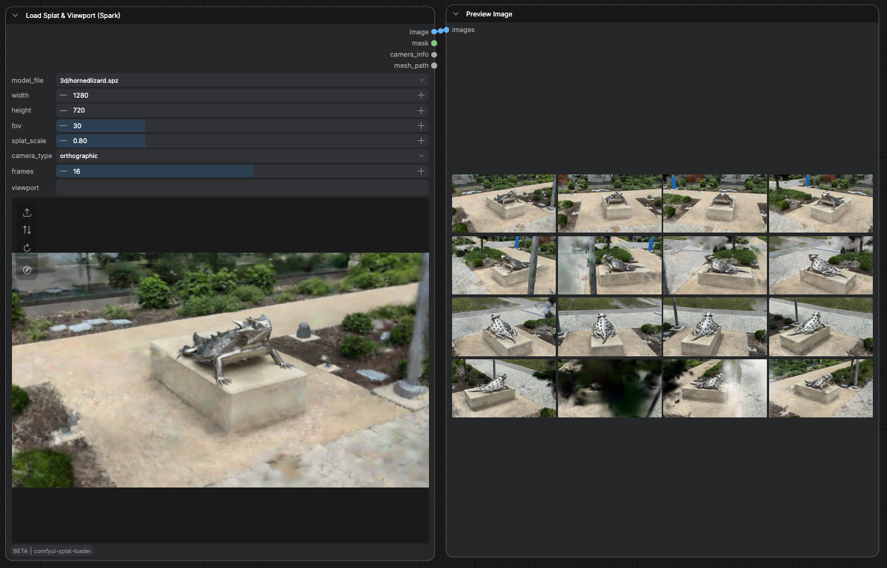

# Splat Loader

Splat Loader is a custom node for [ComfyUI](https://github.com/comfyanonymous/ComfyUI) that loads Gaussian splat files, lets you frame a shot inside the node with a real splat viewport, and outputs exactly that view as an image when you run the workflow. It is heavily inspired by the BETA "Load 3D & Animation" node, but built for Gaussian splats instead of meshes.

The viewport is powered by [Spark](https://sparkjs.dev/), so splats actually render the way they should while you pick your angle.



## Goal of this node
ComfyUI already ships splat nodes, but they only load `.ply` and none of them let you choose a camera angle from inside the node the way the BETA "Load 3D" node does for meshes. The core 3D viewer also does not render Gaussian splats correctly, so framing a shot is guesswork.

Splat Loader fixes both problems: you load a splat, orbit around it in a proper viewport, and what you see is what you get as the image output.

> Note: the image output is captured from the viewport itself, so the result matches your framing exactly. The capture resolution comes from the `width` and `height` inputs.

Supported formats: `.spz`, `.ply`, `.splat`, `.ksplat`.

## How to install

### Via ComfyUI Manager (recommended)
Search for **Splat Loader** in [ComfyUI Manager](https://github.com/Comfy-Org/ComfyUI-Manager) and install it. The prebuilt viewport is bundled, so you do not need Node.js or any build step. Restart ComfyUI when prompted and you are done.

### From source
The viewport is a small web app that has to be built once, so you need [Node.js](https://nodejs.org/). A standard ComfyUI installation does not include it, so install it first if you do not have it.

> Note: Node.js is only needed to build the viewport. ComfyUI itself does not use it.

Clone this repository into your ComfyUI `custom_nodes` directory:
```bash
cd ComfyUI/custom_nodes
git clone https://github.com/brayevalerien/comfyui-splat-loader
```

Then cd into it, install the dependencies and build the viewport bundle:
```bash
cd comfyui-splat-loader
npm install
npm run build
```
This generates `web/viewport.js`, which the frontend loads.

Finally, restart the ComfyUI server and refresh your browser. The node is ready to use.

> Note: if you edit the viewport code later, rerun `npm run build` (or use `npm run watch` to rebuild on every change). A browser hard refresh is then enough, no server restart needed.

## How to use
Add the node by searching for **Load Splat & Viewport (Spark)** (category `3d/splat`).

1. Load a splat file, either with the **Load file** button (opens your filesystem and uploads it into `ComfyUI/input/3d`) or from the `model_file` dropdown if it is already there.
2. Frame your shot in the viewport:
   - **Left drag** to orbit
   - **Right drag** to pan
   - **Scroll** to zoom
   - **Flip up/down** if the splat loads upside down (some files are stored Y-down, some are not)
   - **Reset view** to re-frame on the subject
3. Set `width` and `height` to your output resolution. The viewport letterboxes to that aspect ratio so the preview matches the capture.
4. Run the workflow. The current view is rendered at your chosen resolution and sent to the outputs.

Outputs:
- `image`: the framed view, with a transparent background
- `mask`: the alpha of the splat (the silhouette)
- `camera_info`: the camera used, compatible with the other 3D and splat nodes
- `mesh_path`: the input-relative path of the loaded file

> Note: scrolling only zooms the splat while the cursor is over the viewport. Everywhere else it zooms the ComfyUI canvas as usual.

## Acknowledgements
- [Spark](https://sparkjs.dev/) for the Gaussian splat renderer
- [three.js](https://threejs.org/) for the viewport
- The ComfyUI "Load 3D & Animation" node for the overall idea
